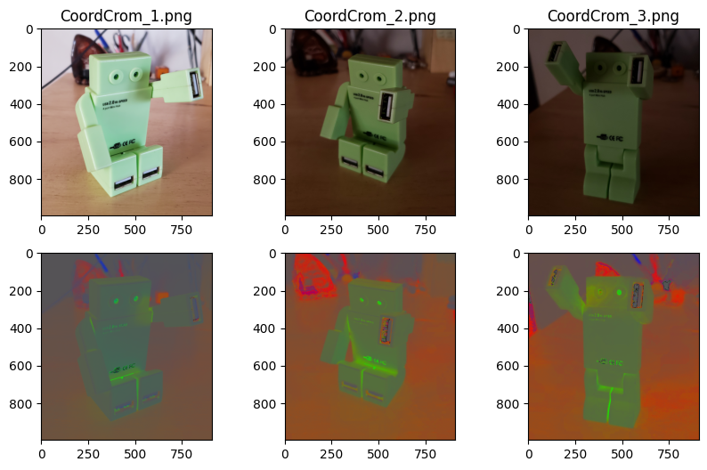

# Visión por Computadora I
- Carrera de Especialización en Inteligencia Artificial
- Autor: Gonzalo Gabriel Fernandez

### Contenido:
1. Operadores de Pixel

## Operadores de Pixel
### [Algoritmo de pasaje a coordenadas cromáticas](./chromatic_coordinates.ipynb).



### [Algoritmo White-Patch](./white_patch.ipynb)

## Environment setup
To create a Python virtual environment for the project:

```sh
python -m venv .venv
```
To activate the virtual environment:

```sh
source .venv/bin/activate
```

To install the required dependencies:

```sh
pip install -r requirements.txt
```
